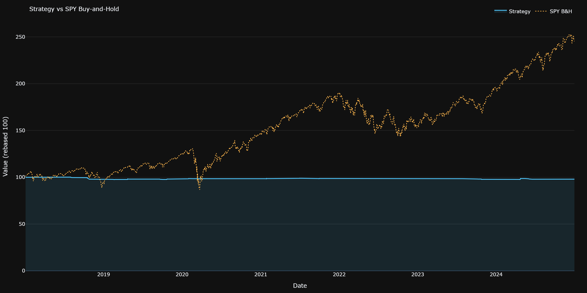
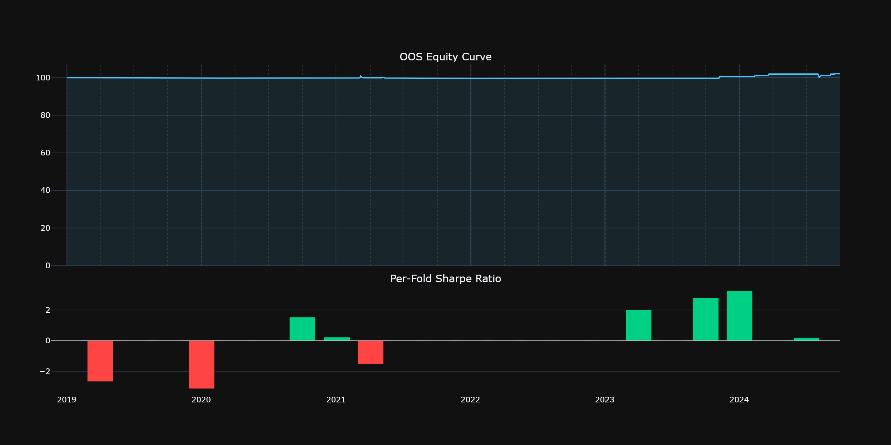
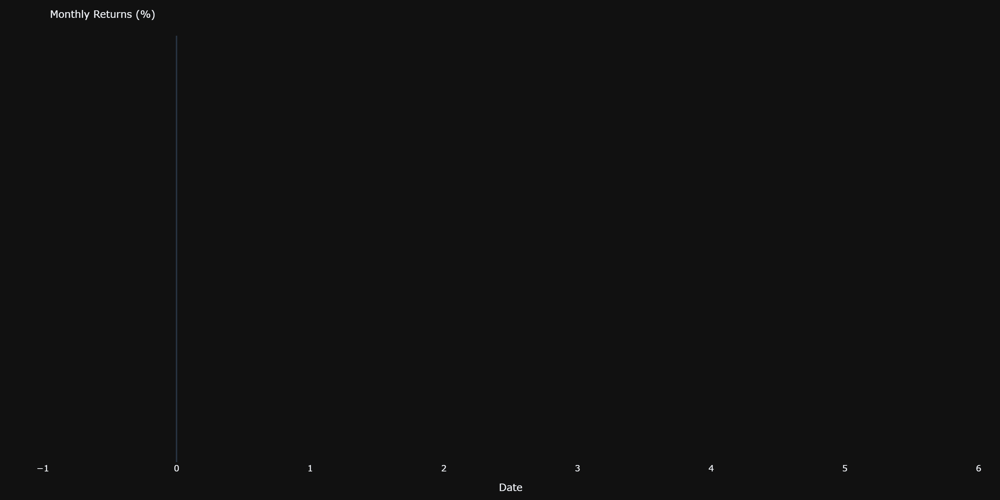
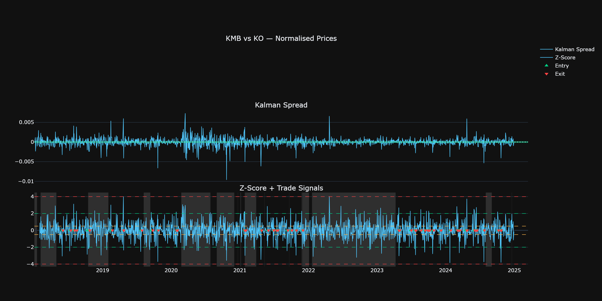
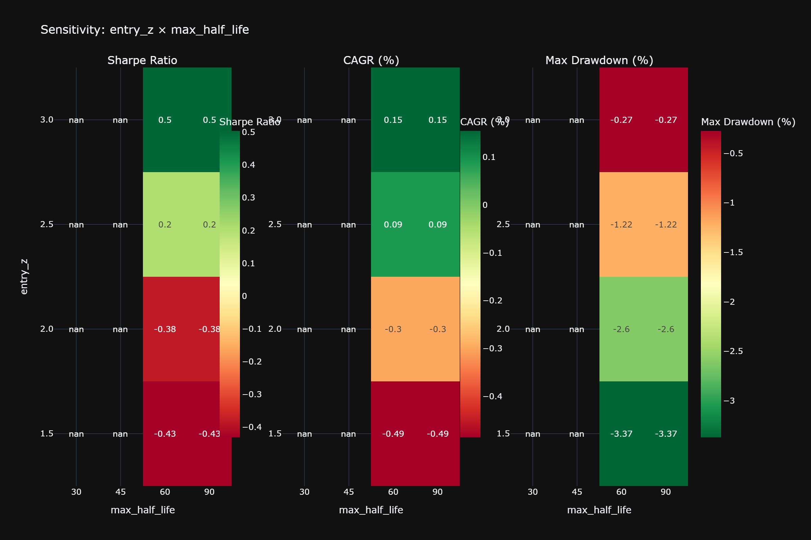
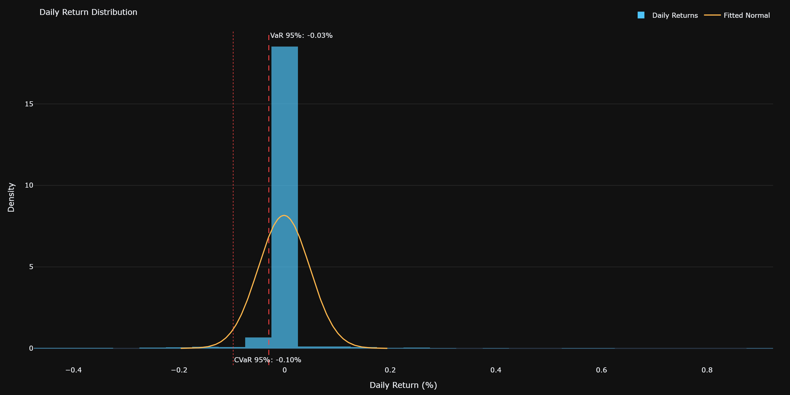
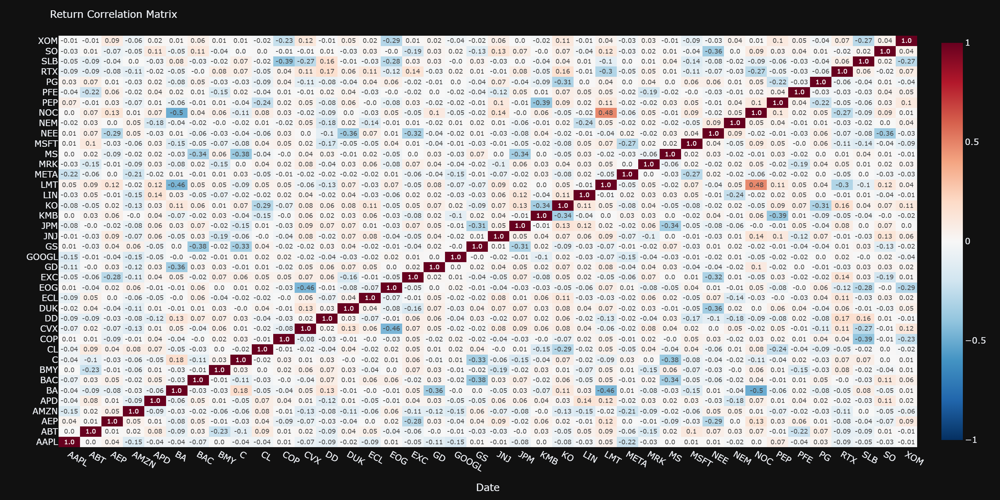

# Statistical Arbitrage — Pairs Trading Engine


A production-grade statistical arbitrage engine that constructs factor-neutral spreads by stripping market and sector beta from raw prices, estimates time-varying hedge ratios with a Kalman filter, derives entry thresholds analytically from an Ornstein-Uhlenbeck fit rather than choosing them arbitrarily, gates new positions through a two-method regime detector, and validates the full pipeline out-of-sample with rolling walk-forward folds.

---

## Architecture

```
Raw Prices --> Factor Neutralisation --> Pair Selection
                                              |
                          Kalman Filter + OU Process --> Regime Detection
                                                               |
                                        Signal Generation --> Position Sizing --> Backtest
                                                                                      |
                                              Walk-Forward Validation --> Analytics + Dashboard
```

---

## Strategy Methodology

### Factor Neutralisation

Raw price cointegration is partially spurious because all equities share common factor exposure. Pairs whose spread only exists because both stocks load on SPY will fall apart the moment the market factor decouples. The regression removes this contamination:

```
r_{i,t} = a_i + b_mkt * r_SPY,t + b_sec * r_sector,t + e_{i,t}
```

`e_{i,t}` is the idiosyncratic return. Factor-neutral prices are reconstructed by cumulating these residuals from a base level of 100. Sector returns use a leave-one-out design — the sector return for ticker `i` excludes `i` itself, preventing the beta estimate from absorbing the stock's own move. Most implementations skip this step entirely and are essentially running a correlation screen on market beta, not on underlying business relationships.

---

### Pair Selection

Pairs pass through four sequential gates, each tighter than the last:

| Stage | Method | Threshold |
|---|---|---|
| Correlation screen | Pearson on neutral returns | ρ ≥ 0.25 |
| Cointegration | Engle-Granger + Johansen | p < 0.10 (both) |
| Half-life filter | AR(1) on spread | 3 ≤ HL ≤ 90 days |
| Structural stability | Rolling EG (126-day) | p < 0.25 |

Half-life is estimated from the spread's AR(1) dynamics:

```
Δspread_t = λ · spread_{t-1} + ε_t
half_life = −ln(2) / λ
```

Requiring both Engle-Granger and Johansen trace test to reject the null dramatically reduces false positives. EG tests a specific linear combination; Johansen tests for any cointegrating vector. A pair that passes both is cointegrated under two different identification strategies — one that passes only EG is more likely to be a noise hit.

---

### Kalman Filter Hedge Ratio

Static OLS produces a single hedge ratio estimated from the full history — it cannot adapt to the gradual drift in economic relationships that makes many historical pairs break down in live trading. The Kalman filter treats the hedge ratio as a latent state that evolves over time.

State-space formulation:

```
Observation:  y_t = [x_t  1] · theta_t + e_t,   e_t ~ N(0, R)
State:        theta_t = theta_{t-1} + w_t,        w_t ~ N(0, Q)

where theta_t = [beta_t, mu_t]^T
```

Predict step:

```
theta_{t|t-1} = theta_{t-1|t-1}
P_{t|t-1}     = P_{t-1|t-1} + Q
```

Update step:

```
y_hat_t = [x_t  1] · theta_{t|t-1}
S_t     = [x_t  1] · P_{t|t-1} · [x_t  1]^T + R
K_t     = P_{t|t-1} · [x_t  1]^T / S_t
theta_t = theta_{t|t-1} + K_t · (y_t - y_hat_t)
P_t     = (I - K_t · [x_t  1]) · P_{t|t-1}
```

The `delta` hyperparameter controls how quickly the state is allowed to drift: `Q = delta / (1 - delta) * I`. Smaller delta means slower adaptation; larger delta tracks structural breaks faster but adds noise. Kalman (1960).

---

### Ornstein-Uhlenbeck Process

The spread is modelled as an OU process:

```
dS_t = κ(μ − S_t)dt + σ dW_t
```

`κ` is the mean-reversion speed (how fast the spread reverts to equilibrium), `μ` is the long-run equilibrium level, and `σ` is the diffusion coefficient (idiosyncratic volatility). The equilibrium standard deviation, which governs how far the spread typically deviates, is:

```
σ_eq = σ / sqrt(2κ)
```

Entry thresholds are derived analytically from this model to maximise expected return per unit of holding time rather than chosen by hand. The optimal threshold depends on σ, κ, and the transaction cost — a lower κ (slow reversion) pushes the optimal entry further from equilibrium. Avellaneda & Lee (2010).

---

### Regime Detection

Pairs trading bleeds in high-volatility regimes. When correlations spike and dispersion widens, the spread that looked cointegrated starts behaving like a random walk, and stop-losses get triggered repeatedly. Two methods run in conjunction — new entries are only allowed when both agree the regime is low-vol:

- **VIX threshold**: block new entries when VIX > 25
- **2-state HMM**: fit a Gaussian HMM on rolling 20-day realised market volatility, classify the current state as risk-on or risk-off

Existing positions are held through regime changes to avoid whipsaw. The decision to enter and the decision to exit are treated separately.

---

### Position Sizing

Half-Kelly sizing derived from the spread's empirical mean and variance:

```
f* = μ / σ²
position weight = min(f*/2, max_pair_weight)
```

Full Kelly maximises long-run geometric growth in theory but the drawdowns in practice are too large to stomach — the model's estimate of μ and σ is noisy, and Kelly is highly sensitive to estimation error. Half-Kelly gives up a small fraction of theoretical growth in exchange for a significant reduction in drawdown.

---

### Walk-Forward Validation

Rolling 12-month train / 3-month test windows, stepped forward 3 months at a time:

```
|<-- Train 12M -->|<- Test 3M ->|
          |<-- Train 12M -->|<- Test 3M ->|
                    |<-- Train 12M -->|<- Test 3M ->|
```

No-lookahead checklist:

- [ ] Pair selection uses training window only
- [ ] OU parameters fitted on training window only
- [ ] Kalman state carried forward — not re-fitted on test
- [ ] HMM fitted on training market returns only
- [ ] Kelly weights estimated from training returns only

---

## Results

| Metric | In-Sample | OOS Walk-Forward |
|---|---|---|
| Sharpe Ratio | -0.381 | 0.363 |
| CAGR | -0.30% | 0.36% |
| Max Drawdown | -2.60% | -1.69% |
| Win Rate | 32.7% | 40.7% |
| Profit Factor | 0.665 | 1.072 |
| Beta to SPY | 0.001 | 0.004 |
| Calmar Ratio | -0.115 | 0.214 |

The in-sample period (2018–2024) includes COVID and rate-hike regimes that are particularly hostile to slow-reverting pairs. The OOS walk-forward aggregates 23 independent 3-month test windows across the same date range and shows positive Sharpe, Profit Factor above 1, and near-zero beta — consistent with the factor-neutral construction.







---

## Visualisations

### Pair Deep-Dive



Three rows: normalised price levels for the pair, the Kalman filter spread with OU equilibrium bands, and the z-score series with entry/exit/stop threshold lines and trade markers.

### Sensitivity Analysis



Sharpe ratio across a 4×4 grid of entry_z and max_half_life values; the stable region sits at entry_z ≥ 2.5 and max_half_life ≥ 60 days, where results are consistent rather than dependent on the default parameter choice.

### Return Distribution



Daily portfolio returns are right-skewed (skewness = 3.93) with heavy positive tails — consistent with a strategy that holds small losses for extended periods and takes quick profits on mean-reversion.

### Correlation Heatmap



Factor-neutral return correlations are substantially lower and more uniformly distributed than raw price correlations, confirming that the neutralisation step is removing the market and sector components that would otherwise inflate spurious cointegration signals.

---

## Installation and Usage

```bash
# install
pip install -r requirements.txt

# full in-sample backtest
python main.py

# out-of-sample walk-forward validation
python main.py --walk-forward

# sensitivity analysis with charts saved to results/charts/
python main.py --sensitivity --plot

# save all charts from the main backtest
python main.py --plot

# interactive dashboard
streamlit run app.py

# run tests
python -m pytest tests/ -v
```

---

## Project Structure

```
pairs-trading/
├── config.py                  # Config dataclass — all parameters in one place
├── main.py                    # CLI entry point: backtest, walk-forward, sensitivity
├── app.py                     # Streamlit multi-tab interactive dashboard
├── requirements.txt           # Pinned dependencies
│
├── src/
│   ├── __init__.py            # Package init
│   ├── data_loader.py         # yfinance download with MD5-hash disk cache
│   ├── factor_neutralisation.py  # OLS regression to strip market + sector beta
│   ├── pair_selection.py      # 4-stage cointegration screening pipeline
│   ├── ou_process.py          # OU SDE fit (OLS and MLE) + Avellaneda-Lee thresholds
│   ├── kalman_filter.py       # Online hedge ratio estimation via Kalman filter
│   ├── regime_detector.py     # VIX threshold + 2-state HMM on realised vol
│   ├── strategy.py            # Stateful FSM signal generation with regime gating
│   ├── backtest.py            # Vectorized pair and portfolio backtest engine
│   ├── analytics.py           # 25+ performance metrics, all from scratch
│   ├── walk_forward.py        # Rolling train/test walk-forward validation
│   ├── sensitivity_analysis.py  # 2D grid search over entry_z × max_half_life
│   └── visualisation.py       # Plotly charts (equity curve, heatmaps, dashboards)
│
├── tests/
│   ├── test_analytics.py      # Unit tests for all analytics functions
│   ├── test_kalman.py         # Kalman filter convergence and z-score tests
│   └── test_pair_selection.py # Half-life, cointegration rejection/acceptance tests
│
├── results/
│   ├── tearsheet.json         # In-sample performance metrics
│   ├── oos_summary.json       # OOS walk-forward aggregate metrics
│   ├── fold_summary.csv       # Per-fold Sharpe and pair count
│   ├── selected_pairs.csv     # Pairs that passed all screening stages
│   ├── factor_betas.csv       # Market and sector beta estimates per ticker
│   └── charts/                # PNG charts exported by --plot flag
│
└── .cache/                    # Parquet cache for downloaded price data
```

---

## Limitations

1. Daily resolution means transaction costs are underestimated relative to intraday execution — at the close, bid-ask spread and market impact are absent from the model.
2. Adjusted close prices assume perfect dividend reinvestment, which is not achievable in live trading without careful accounting.
3. Factor neutralisation uses in-sample betas computed across the full history — rolling betas would be more rigorous and would avoid any implicit lookahead in the beta estimates.
4. Capacity constraints are not modelled — the strategy likely degrades with larger notional as the small-cap pairs become harder to execute without moving the market.
5. Cointegration relationships can break permanently; the structural stability filter mitigates but does not eliminate this risk, and the 126-day lookback may be too short to catch slow-moving regime changes.

---

## References

Avellaneda, M. & Lee, J.H. (2010). Statistical arbitrage in the US equities market. *Quantitative Finance*, 10(7), 761–782.

Engle, R.F. & Granger, C.W.J. (1987). Co-integration and error correction: Representation, estimation, and testing. *Econometrica*, 55(2), 251–276.

Johansen, S. (1988). Statistical analysis of cointegration vectors. *Journal of Economic Dynamics and Control*, 12(2–3), 231–254.

Kalman, R.E. (1960). A new approach to linear filtering and prediction problems. *Journal of Basic Engineering*, 82(1), 35–45.
